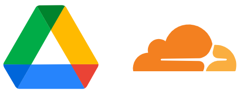

使用 Cloudflare Workers 为 Google Drive 提供 WebDAV 支持

WebDAV supports for Google Drive using Cloudflare Workers

__功能开发中 / This project is under development.__

## 主要功能

| |功能|WebDAV Methods|请求处理方法|Google Drive 接口|
|---:|:---:|:---:|:---|:---|
|√|获取支持选项|OPTIONS|options()|/|
| |获取资源属性 目录层次结构|PROPFIND|propfind(path, depth)|**TBD**|
| |更改/删除资源属性|PROPPATCH|**TBD**|**TBD**|
| |新建目录|MKCOL|mkcol(path)|mkdir(path)|
| |获取文件内容|GET|get(path, range)|fetchFile(path, range)|
| |无响应消息体的 GET|HEAD|head(path)|**TBD**|
| |删除文件/目录|DELETE|unlink(path)|unlink(path)|
| |修改文件内容|PUT|**TBD**|**TBD**|
| |复制文件/目录|COPY|**TBD**|**TBD**|
| |移动/重命名文件/目录|MOVE|move(src, dest)|**TBD**|
| |锁定文件/目录|LOCK|lock(path)|**暂不支持**|
|√|解锁文件/目录|UNLOCK|unlock()|**暂不支持**|

## 文档 / Docs

1. [Google Drive API](doc/Google%20Drive%20API.md)
2. [WebDAV Methods](doc/WebDAV.md)

## TODO

1. 参考 RFC 4918 修改已有的 WebDAV 文档
2. 考虑到 WebDAV 客户端是可靠的，逐步移除部分异常处理代码
3. 添加部署文档

## 参考内容 / References

1. [Google Drive API v3](https://developers.google.com/drive)
2. [RFC 4918](http://www.webdav.org/specs/rfc4918.html) (WebDAV revision)
3. [RFC 2518](http://www.webdav.org/specs/rfc2518.html) (First WebDAV spec)
4. [WebDAV Methods | Microsoft Docs](https://docs.microsoft.com/en-us/previous-versions/office/developer/exchange-server-2003/aa142917(v=exchg.65))

## 许可 / License

[MIT License](LICENSE)